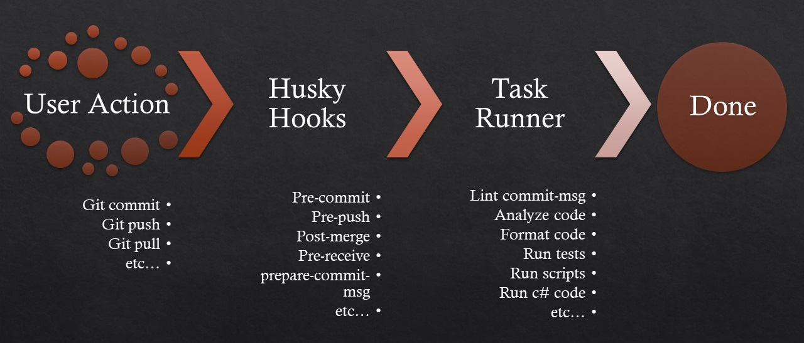

# Husky.Net


## Introduction

Husky improves your commits and more 🐶 woof!

You can use it to lint your commit messages, run tests, lint code, etc... when you commit or push.

**Features**

- 🔥 Internal task runner!
- 🔥 Multiple file states (staged, lastCommit, glob)
- 🔥 Compatible with [dotnet-format](https://github.com/dotnet/format)
- 🔥 Customizable tasks
- 🔥 Supports task for specific branches
- 🔥 CSharp scripts (csx)! 🆕
- 🔥 Supports gitflow hooks 🆕
- Supports all Git hooks
- Powered by modern new Git feature (core.hooksPath)
- User-friendly messages
- Supports macOS, Linux and Windows
- Git GUIs
- Custom directories
- Monorepo


If you already know what is the lint-staged or Husky (npm packages),
this is very similar but you can use Husky.Net without having node, yarn, etc.. installed, with a lot of more features! 🚀🚀

## Why use Hooks and Husky.Net?

We, as developers, love platforms like GitHub, GitLab, Atlassian, Azure DevOps etc., as our managed git system and collaboration platform. We also love clean code and keep inventing new linters and rules to enforce it. In my opinion, every commit should allow the codebase to deploy to production. There is nothing worse than commits like “fixed style errors” or “fixed build”. These are often small mistakes you want to know as early as possible in your development cycle. You don’t want to break the build for the next developer because he pulled your ‘mistake’ or waste precious build minutes of your CI server. Say you have asked your teammate to review your code; in the meantime, the build server rejects your code. That means you have to go back and fix this, and your teammate has to come back and possibly review again after the changes (i.e., approvals reset on new commit). Doing so would waste a lot of time and effort. Husky.Net offers a very simple way to start using git hooks or running certain tasks, write custom scripts using c# and more ...

### A lot of features are coming soon, stay tuned! 👁️‍🗨️👀

## Installation

```shell
# local installation (recommended)
cd <Your project root directory>
dotnet new tool-manifest
dotnet tool install Husky

# global installation
dotnet tool install --global Husky

```
_**Note**: With the global installation, you don't need to add the `dotnet` prefix to the commands._

### Setup husky for your project

```shell
cd <Your project root directory>
dotnet husky install
```

### Add your first hook

```shell
dotnet husky add .husky/pre-commit "echo 'Husky is awesome!'"
git add .husky/pre-commit
```

### Make a commit

```shell
git commit -m "Keep calm and commit"
# `echo 'Husky is awesome!'` will run every time you commit
```

## Automate husky installation for other contributors

If you installed husky locally, just add the below code to **one** of your projects (*.csproj *.vbproj).

**Important:** Just make sure to update the **working directory** depending on your folder structure.

```xml
<Target Name="husky" BeforeTargets="Restore;CollectPackageReferences">
   <Exec Command="dotnet tool restore"  StandardOutputImportance="Low" StandardErrorImportance="High"/>
   <Exec Command="dotnet husky install" StandardOutputImportance="Low" StandardErrorImportance="High"
         WorkingDirectory="../../" />  <!--Update this to the releative path to your project root dir -->
</Target>
```

If you have only one multiple target project (`TargetFrameworks`) add the bellow condition `IsCrossTargetingBuild` to the target tag to prevent multiple execution
```xml
<Target Name="husky" BeforeTargets="Restore;CollectPackageReferences" Condition="'$(IsCrossTargetingBuild)' == 'true'">
   ...
```

Or If you are using the `npm`, add the below code to your `package.json` file to automatically install husky after the installation process:
```json
 "scripts": {
    "prepare": "dotnet tool restore && dotnet husky install"
 }
```

---

## Task runner

Linting makes more sense when run before committing your code. By doing so you can ensure no errors go into the repository and enforce code style. But running a lint process on a whole project is slow, and linting results can be irrelevant. Ultimately you only want to lint files that will be committed.

After installation, you must have `task-runner.json` file in your `.husky` directory that you can use to define your tasks.

you can run and test your tasks with `husky run` command. Once you are sure that your tasks are working properly, you can add it to the hook.

e.g.

```shell
dotnet husky add .husky/pre-commit "dotnet husky run"
```
<details>
<summary>A simple real-world example <code>task-runner.json</code></summary>
<p>

```json
{
   "tasks": [
      {
         "command": "dotnet",
         "group": "backend",
         "args": ["dotnet-format", "--include", "${staged}"],
         "include": ["**/*.cs", "**/*.vb"]
      },
      {
         "name": "eslint",
         "group": "frontend",
         "command": "npm",
         "pathMode": "absolute",
         "cwd": "Client",
         "args": ["run", "lint", "${staged}"],
         "include": ["**/*.ts", "**/*.vue", "**/*.js"]
      },
      {
         "name": "prettier",
         "group": "frontend",
         "command": "npx",
         "pathMode": "absolute",
         "cwd": "Client",
         "args": ["prettier", "--write", "${staged}"],
         "include": [
            "**/*.ts",
            "**/*.vue",
            "**/*.js",
            "**/*.json",
            "**/*.yml",
            "**/*.css",
            "**/*.scss"
         ]
      },
      {
         "name": "Welcome",
         "output": "always",
         "command": "bash",
         "args": ["-c", "echo  🌈 Nice work! 🥂"],
         "windows": {
            "command": "cmd",
            "args": ["/c", "echo  🌈 Nice work! 🥂"]
         }
      }
   ]
}

```

</p>
</details>

<br>

### Task supported configurations

Using bellow configuration you can define your task with a lot of options.

---

| name     | optional | type                     | default                | description                                                            |
|----------|----------|--------------------------|------------------------|------------------------------------------------------------------------|
| command  | false    | string                   | -                      | path to the executable file or script or executable name               |
| args     | true     | [string array]           | -                      | command arguments                                                      |
| include  | true     | [array of glob]          | `**/*`                 | glob pattern to select files                                           |
| name     | true     | string                   | command                | name of the task (recommended)                                         |
| group    | true     | string                   | -                      | group of the task                                                      |
| branch   | true     | string (regex)           | -                      | run task on specific branches only                                     |
| pathMode | true     | [absolute, relative]     | relative               | file path style (relative or absolute)                                 |
| cwd      | true     | string                   | project root directory | current working directory for the command, can be relative or absolute |
| output   | true     | [always, verbose, never] | always                 | output log level                                                       |
| exclude  | true     | [array of glob]          | -                      | glob pattern to exclude files                                          |
| windows  | true     | object                   | -                      | overrides all the above settings for windows                           |

---

### Arg Variables

There are some variables that you can use in your task arguments.

- **${staged}**
  - returns the list of currently staged files
- **${LastCommit}**
  - returns last commit changed files
- **${matched}**
  - returns the list of matched files using include and exclude, be careful with this variable, it will return all the files if you don't specify include or exclude

e.g.`"args": [ "${staged}" ]`

## Glob patterns

Husky.Net supports the standard dotnet `FileSystemGlobbing` patterns for include or exclude task configurations. read more [here](https://docs.microsoft.com/en-us/dotnet/core/extensions/file-globbing#pattern-formats)

---

## Using C# code in your git hooks

You can use the `exec` command to execute a C# script.

e.g.
```shell
dotnet husky exec .husky/csx/hello.csx
```

Also, you can use your csx scripts in your tasks.

e.g task
```json
{
   "command": "dotnet",
   "args": [ "husky", "exec", ".husky/csx/hello.csx"  ],
}

```

---


## Notes

- Consider all bellow 1.x versions as beta. ( we need a lot of tests before major release )

- Don't forget to give a ⭐ on [GitHub](https://github.com/alirezanet/husky.net)

- This library inspired of [husky](https://github.com/typicode/husky) & [lint-staged](https://github.com/okonet/lint-staged) and a few other tools, for **DotNet**, so make sure to support them too!

## Known issues
- `husky run` command doesn't have color when executed from hooks.
