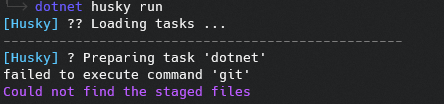
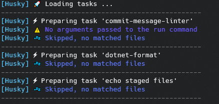

# Troubleshoot

## Missing Emojis

If emojies are missing when you use `Husky.Net` under Windows environment you can check these points below :

- You have the latest version of [Windows Terminal](https://www.microsoft.com/en-us/p/windows-terminal/9n0dx20hk701#activetab=pivot:overviewtab)
- The font used by the terminal is a [powerline](https://github.com/powerline/fonts) or a [nerd fonts](https://www.nerdfonts.com/)
- You have enable the new UTF-8 option in Windows settings
  1. Go to the [Language Settings](ms-settings:regionlanguage)
  2. Administrative language settings > Change system locale > Check `Beta: Use Unicode UTF-8 for worldwide language support`
  3. Restart your computer

|Before|After|
|-|-|
|||

### Disabling Emojis

If none of the above solutions worked, you can disable husky unicode characters by setting the `HUSKY_NOUNICODE` environment variable to `true` or use the `no-unicode` or `-u` option after `husky run` command.
